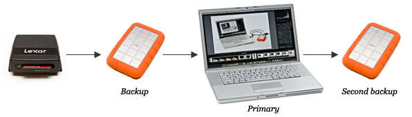

```{r setup, include=FALSE}
knitr::opts_chunk$set(echo = TRUE)
```

```{r image, echo=FALSE, fig.cap="", out.width = '90%'}

```

## On Backup Workflow 

Tips from: <https://photographylife.com/photography-backup-workflow>

Here are my recommendations on setting up a workflow process:

1. Do not reinvent the wheel - use best practices
2. Do not oversimplify
3. Do not overcomplicate
4. Do not dismiss important workflow components
5. Take time to establish a good, solid workflow
6. Once solid workflow is established, stick to the same process for consistency and efficiency
7. If new technology is available or there is a faster/better way to do something, make your workflow flexible to potentially modify it as needed
8. Look at all recommended options before committing to a certain workflow process (again refer to point #1)

### [Hybrid File Management](https://youtu.be/dBhVvU8ZD4w) for photography and videos:

1. First, decide on a master folder to store your photos, such as "Photos" or "Pictures". Ideally, put it in a root folder of your storage drive, as previously explained.
2. Come up with a proper and consistent way to name files, so that you have enough information on the file system level to be able to quickly locate files. Ideally, each of your file names should contain the date (year, month and day) and the name of the event or sub-event, followed by a sequence number.
3. Import images using software such as Lightroom and create folder structure during the import process. Images should be renamed at the time of import.
4. Do not heavily rely on keywords and other software-based indexing criteria to reduce software dependency. If you need to reorganize or rename images, do that through software to avoid potential mismatches between the database and the file system. Software such as Lightroom performs moving and renaming of images on the file system level and automatically remaps images in the database after the completion of the process. Use the provided tools to mass-rename images when necessary.
5. After completing the editing process, force the software to write changes to each image (this will write changes to DNG files or force the creation of sidecar / XMP files), so that you do not lose your changes if your database gets corrupted or lost.

### Simple backup

So here is the quick summary:

1. At the minimum, buy two external drives for backups
2. Backup to one drive on a continuous basis either using automated software tools, or manual file copy
3. Backup to the second drive as often as you will be taking it offsite. You can rotate the two drives, but you have to make sure that you are not just doing incremental / differential backups - you have to have full backups for rotation

If you follow this process, you will have your images stored in three places: your computer, an external drive connected to your computer and another external drive that is sitting in an offsite location.

### Solid Backup Strategy: Serious Amateurs and Pros

**RAID is not a form of Backup!**

Whether you run RAID 1 (mirroring), RAID 5 (striping) or any other type of redundant RAID, never make an assumption that your data is backed up and you do not need to back it up elsewhere. RAID does not replace backup. When RAID volumes need to be rebuilt, especially if it is a RAID 5 volume, there is always a chance that another drive might fail during the rebuild process. In fact, most people buy drives for a RAID volume in the same time-frame, which increases the chance of more than one drive dying at the same time. RAID is great to keep your storage running and keep you working, but you should always have at least two more backups, as explained above.

What about external storage? Remember, for a [3-2-1 backup](https://www.us-cert.gov/sites/default/files/publications/data_backup_options.pdf)^[All computer users, from home users to professional information security officers, should back
up the critical data they have on their desktops, laptops, servers, and even mobile devices to
protect it from loss or corruption. Saving just one backup file may not be enough to safeguard
your information. To increase your chances of recovering lost or corrupted data, follow the 3-2-1
rule:
3 - Keep 3 copies of any important file: 1 primary and 2 backups.
2 - Keep the files on 2 different media types to protect against different types of hazards.
1 - Store 1 copy offsite (e.g., outside your home or business facility).
This paper summarizes the pros, cons, and security considerations of backup options for critical
personal and business data.], you will need at least two more backups on different media, with one being an off-site backup. Which means that aside from your working machine, you will need a primary backup device and a secondary backup device that will be taken off-site. I recommend that you size your primary backup device with a good potential for future growth.

Whatever backup options you choose, remember to follow the 3-2-1 rule of backups:

3 - Keep **3** copies of any important file: 1 primary and 2 backups.

2 - Keep the files on **2** different media types to protect against different types of hazards.

1 - Store **1** copy offsite (e.g., outside your home or business facility). 

[More on 3-2-1 and on pros and cons](https://www.dpbestflow.org/backup/backup-overview#321)

To recap, here is my recommended backup process for serious amateurs, semi-pros and pros:

1. Dedicate two separate hard drives for images on your editing machine. Put them in RAID 1 configuration for redundancy.
2. Get an external storage array with 4+ drives to make it your primary backup volume.
3. Either use another external storage for off-site backups, or subscribe to a solid cloud solution tailored for photographers.
4. Use automated software for backups to replicate data in order to improve speed and efficiency of backups.

### Example

1. **Primary Editing Machine**: Two 1 TB SSD drives in **RAID 1** for performance dedicated for image editing. Only images that need to be edited are copied / imported to this drive due to the small size of this SSD volume, which is typically images from the current year. Data is backed up automatically via Synology Cloud Station client.
2. **Primary Backup Storage**: Synology DS1815+ with 8x 5TB 7200 RPM drives in **RAID 5** configuration. The volume is mapped on my primary PC as a drive and all current photos are stored there. Older images are accessed directly through the network (Images in Lightroom are mapped to the network volume), as shown below:
3. **Secondary Backup Storage**: DroboPro with 8x 2TB 7200 RPM drives (my older backup storage) in **BeyondRAID** configuration. **Data is manually replicated** from the Synology DS1815+ **every month**.
4. **Tertiary Backup Storage**: ioSafe 214 (fireproof and waterproof) with two 5 TB NAS drives in **RAID 0** configuration. Data is replicated with DS1815+ via Synology Cloud Station client.
5. WD My Book Duo 12 TB: **two drives in rotation for off-site backup** (drop off in a PO Box). Data is replicated with DS1815+ via Synology Cloud Station client. Soon to **change to cloud backup** for convenience.


## Data Storage Solutions

### 0. Capture Data

- Memory Cards (delete when data is on both working drive and main storage, or when on next step)
- Backup on the road [Samsung Portable SSD T1 Review - USD 350](https://photographylife.com/reviews/samsung-portable-ssd-t1)

### 1. Primary (Working) Drive

- Lacie Rugged (Macbook Air)
- Internal Drive (Future Macbook Pro)
- RAID (Main Storage - RAID10?)

### 2. Main Storage (RAID 10)

- 4 bay array: NAS Western Digital My Cloud EX4100 (from R$ 3770 - 4250) <https://www.boadica.com.br/produtos/p148055/western-digital-wdbwze0000nbk-nesn>

- 4 bay array: Seagate / STDE100 (from R$ 4414 - 4422) <https://www.boadica.com.br/produtos/p130784/seagate-stde100>

- 6 bay array: Seagate / STDF100 6-Bay NAS Pro Server Enclosure (from R$ 6417 - 6424 / USD 700-discontinued) <https://www.boadica.com.br/produtos/p133124/seagate-stdf100> [from BH Photo - unavailable](https://www.bhphotovideo.com/c/product/1088351-REG/seagate_763649059371_stdf100_6_bay_nas_pro.html)
6xSATA-II 150Watt 3kg (2xEthernet1000 / 1xUSB2 / 2xUSB3) (17.0 x 23.6 x 21.8cm)

- [Synology DiskStation DS1817+ 8-Bay NAS Enclosure (USD 950)](https://www.bhphotovideo.com/c/product/1092655-REG/synology_ds1815_8_bay_usb_esata.html) - [Review](https://photographylife.com/reviews/synology-ds1815) - [WD 4TB Network OEM HDD Retail Kit (8-Pack, WD40EFRX, Red Drives)  (USD 970)](https://www.bhphotovideo.com/c/product/1055209-REG/wd_wd40efrx_4tb_red_sata_3_5.html)

### 3. Backup Storage (Permanent)

- **Storage 1**: Large External HD (RAID 1) - BiWeekly
- **Storage 2**: Smaller External HD - Monthly

### 4. Off-site Backup (Permanent)

- **Storage 3**: Smaller External HD - Every Quarter

### 5. Cloud Storage (LQ - web)

Photos:

- Google Photos
- Flickr
- 500px

Videos:

- YouTube
- ???

## File Structure

```{r twee_function, echo=FALSE}

#from: https://gist.github.com/jennybc/2bf1dbe6eb1f261dfe60

## quick-and-dirty ersatz Unix tree command in R
## inspired by this one-liner:
## ls -R | grep ":$" | sed -e 's/:$//' -e 's/[^-][^\/]*\//--/g' -e 's/^/   /' -e 's/-/|/'
## found here (among many other places):
## http://serverfault.com/questions/143954/how-to-generate-an-ascii-representation-of-a-unix-file-hierarchy

twee <- function(path = getwd(), level = Inf) {
  
  fad <-
    list.files(path = path, recursive = TRUE,no.. = TRUE, include.dirs = TRUE)

  fad_split_up <- strsplit(fad, "/")

  too_deep <- lapply(fad_split_up, length) > level
  fad_split_up[too_deep] <- NULL
  
  jfun <- function(x) {
    n <- length(x)
    if(n > 1)
      x[n - 1] <- "|__"
    if(n > 2)
      x[1:(n - 2)] <- "   "
    x <- if(n == 1) c("-- ", x) else c("   ", x)
    x
  }
  fad_subbed_out <- lapply(fad_split_up, jfun)
  
  cat(unlist(lapply(fad_subbed_out, paste, collapse = "")), sep = "\n")
}

twee("data/datapost")

# Media Volume XX
#         YYYY
#                 YYYY.MM.Location/Event
#                                 DD
#                                         Source
#                                                 DSLR
#                                                         Photos
#                                                                 1. RAW/Original
#                                                                 2. Master
#                                                                 3. Layered_Master
#                                                                 3.1. Panorama / HDR / Timelapse
#                                                                 4. Final Edits (web / print)
#                                                         Videos
#                                                                 1. Original
#                                                                 2. Edits
#                                                 Drone
#                                                         Photos
#                                                                 1. Original
#                                                                 2. Edits
#                                                         Videos
#                                                                 1. Original
#                                                                 2. Edits
#                                                 Iphone
#                                                         Photos
#                                                                 1. Original
#                                                                 2. Edits
#                                                         Videos
#                                                                 1. Original
#                                                                 2. Edits
#                 YYYY.MM.Project_Name    (Photos)
#                                 2. Master
#                                 3. Layered_Master / Project_Type_Selection
#                                 4. Final Edits
#                 YYYY.MM.Project_Name    (Videos)
#                                 2. Selected_Originals
#                                 3. Final Edits

```

### File Naming:

1. Original Files: `[Author]_YYYYMMDD_[Source/Camera]_[Event]_[SequenceNumber].[file_extension]`
2. Masters: `[Author]_YYYYMMDD_[Source/Camera]_[Event]_[SequenceNumber]_M.[file_extension]`
3. Layered Masters: `[Author]_YYYYMMDD_[Source/Camera]_[Event]_[SequenceNumber]_LM.[file_extension]`
4. Final Edits: `[Author]_YYYYMMDD_[Source/Camera]_[Event]_[SequenceNumber]_LM_[edit_type].[file_extension]`

Where:

- Author: is the photographer or source of the material
- Source/Camera: is the device that generated the new data
- Event: is the location or event that is associated with the shots
- Sequence Number: should be cronological sequential numbering of the files by event

- Originals are only ingested and renamed (.RAW)
- Masters are processed and batch edited for lens correction, metadata insertion, and sorting for post-production and editing (M.TIFF)
- Layered Masters are master files after all editing and processing was done, but before converting to more appropriate resolution for publishing (LM.TIFF)
- Final Edits are the data after all the steps and with appropriate size and resolution for its specific applications (LM_web.jpg / LM_instagram.jpg / LM_print.jpg)

## Links to continue:

[Photography Backup Workflow](https://photographylife.com/photography-backup-workflow)

[What is a Photography Workflow?](https://photographylife.com/what-is-photography-workflow)

[How to Organize Pictures](https://photographylife.com/how-to-organize-pictures)

[How to Organize Photos in Lightroom](https://photographylife.com/how-to-organize-photos-in-lightroom)


7) Post-import check
Now that you know how to import your images with custom templates, go ahead and import all of your pictures into Lightroom and make sure that everything gets transitioned correctly. Do not forget to change the folder names along with "Custom Text" and "Keywords" fields upon each new import in the "Import Photos" screen going forward. Otherwise, you will end up with a bunch of unwanted folders and incorrect file names and keywords. If you accidentally imported your pictures with wrong settings, it is not a problem. Just select the imported pictures, then change the keywords under "Keywording" section in the "Library" module, then rename the folder to the correct event name and press "F2" or go to Library -> Rename Photos to mass rename your pictures. If your pictures go out of sequence for whatever reason (for example your sequence numbers are repeated, but with a different name), then simply select all pictures and batch-rename them all by pressing "F2" on your keyboard. Give it a new sequence number and it will start renaming them based on the age of the image or your selection criteria.

8) Perform full backup
By now, you have done a lot of work to re-organize your photographs and you have completed importing all of your pictures into Lightroom. It is definitely a good time to perform a full backup of both your Lightroom catalog and your pictures. Many people assume that the backup functionality in Lightroom backs up their photographs too. That's a very wrong assumption! Lightroom does NOT backup your photos - it only backs up your Lightroom catalog, which is useless without your images. You can afford losing a Lightroom database, but you cannot afford losing your pictures. Therefore, you should always backup your photographs first, then worry about Lightroom.

Here is how to perform a full backup:

1. Close out of Lightroom.
2. Get your external backup drive ready, plug it into your computer and turn it on.
3. Go to the root folder where you are keeping your photos. In my computer it is `"E:\Photos"`. Select this folder and drag and drop it into the backup drive's "Photos Backup" folder or something similar, which should start the copy process.
4. Wait until all pictures are copied / backed up. Make sure that you do not have any errors and the copy process is completed 100% successfully.
5. Now backup your Lightroom catalog. Locate the Lightroom catalog file in your hard drive (which should have an extension "lrcat") and also copy it to the external drive. I usually store my Lightroom catalogs in a folder called "Lightroom Catalog Backup" on my backup media.

The above process could be easily automated by third party backup programs or with some built-in backup tools within your operating system. I highly recommend to set up an automated job that backs up your computer as often as possible. I also recommend backing up your data to at least two different locations every time, as explained in our "Basic Backup Tips for Beginners" article.

## Other Topics

[How to Photograph the Milky Way](https://photographylife.com/landscapes/how-to-photograph-the-milky-way)

[DJI MAvic Air Review - with photos, lots of them](https://photographylife.com/reviews/dji-mavic-air) **-** [MavicAir - BoaDica (R$ 4499 - 4599)](https://www.boadica.com.br/produtos/p156579/dji-mavic-air-preto-onyx-black-combo-fly-more)

[Platypod Pro Max Review - USD 99](https://photographylife.com/reviews/platypod-pro-max)

### RAID Levels
[Standard RAID Levels](https://en.wikipedia.org/wiki/Standard_RAID_levels): RAID 6 does not have a performance penalty for read operations, but it does have a performance penalty on write operations because of the overhead associated with parity calculations. Performance varies greatly depending on how RAID 6 is implemented in the manufacturer's storage architecture-in software, firmware, or by using firmware and specialized ASICs for intensive parity calculations. RAID 6 can read up to the same speed as RAID 5 with the same number of physical drives.

[Nested RAID Levels](https://en.wikipedia.org/wiki/Nested_RAID_levels): RAID 10 is the preferable RAID level for I/O-intensive applications such as database, email, and web servers, as well as for any other use requiring high disk performance.

